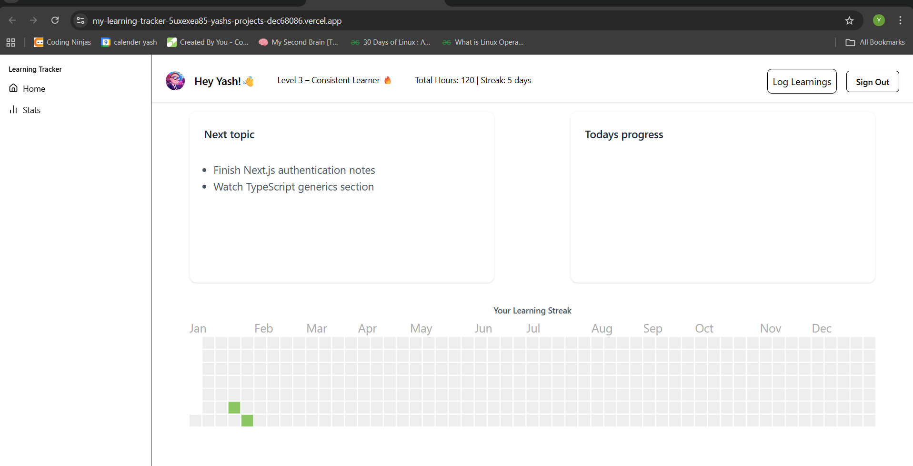
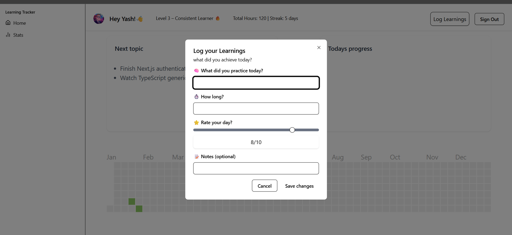

# 🧠 Learning Tracker

- A web app to track my daily learning progress across topics like React, Data Structures, TypeScript, and more — with streaks, stats, and notes.

# 🚀 What Problem I'm Solving

- I often struggled to stay consistent while learning.
- This app helps me track what I learn each day, stay accountable, and visualize progress with streaks and stats.

# 👤 Who This Is For

- Initially built for myself — to develop consistency and build in public.
- Later, it could help other devs who also struggle to stay consistent while learning.

## 🎯 MVP Goal

- Users can log a learning session (topic, duration, and notes)

- Track streaks and total learning hours

- View stats and insights from past sessions

## 🧩 Tech Stack

- Next.js (App Router)

- TypeScript

- Tailwind CSS + shadcn/ui

- MongoDB Atlas

- Auth.js (Google Login)

## 🧠 Daily Dev Journal

- I’m documenting the entire journey of building this app here 👇
  🔗[my github journal](https://github.com/yashmore007/project-learning-tracker/tree/main/journals)

  🔗[index of journals](https://github.com/yashmore007/project-learning-tracker/blob/main/journal-index.md)

## 📸 Preview

🔗[Live App](https://my-learning-tracker.vercel.app/)

## screenShots of the app

# 💬 Connect

- If you’re into Next.js, Auth.js, or building tools for developers, let’s connect!

[linkedin](https://www.linkedin.com/in/yashmore/)
